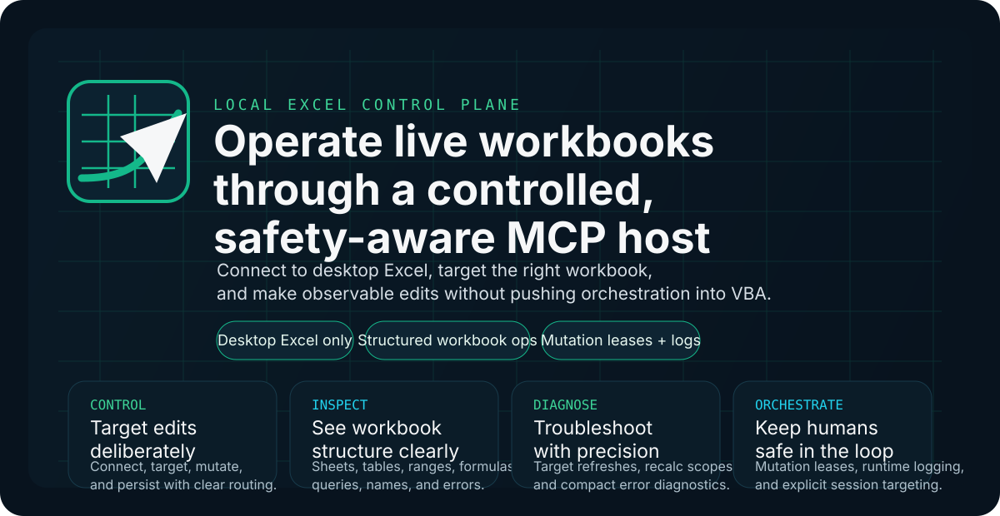
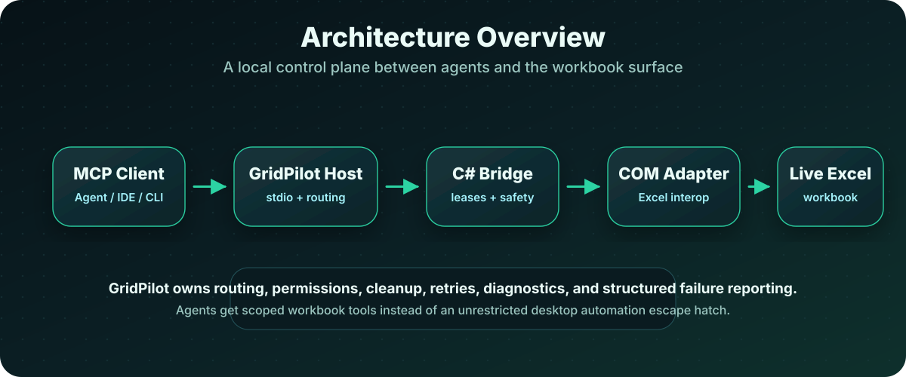
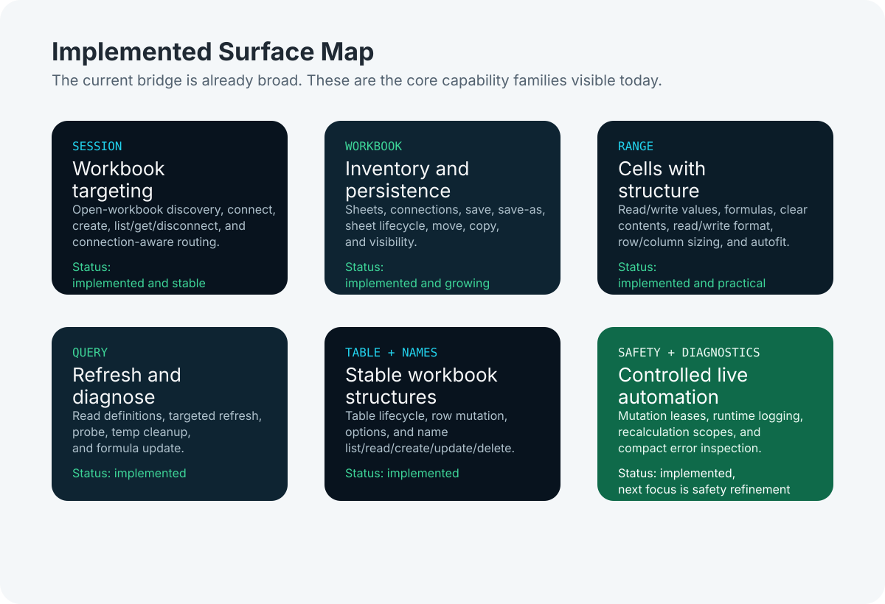
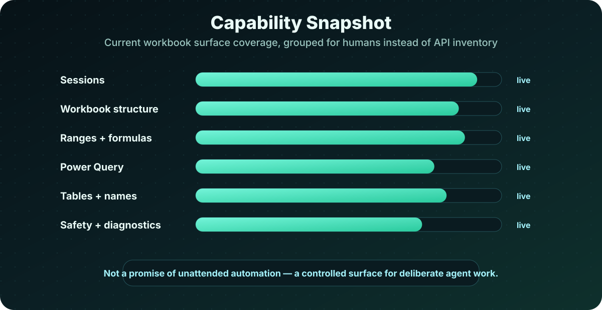
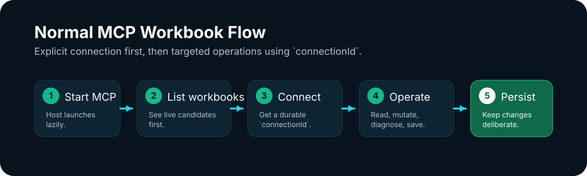
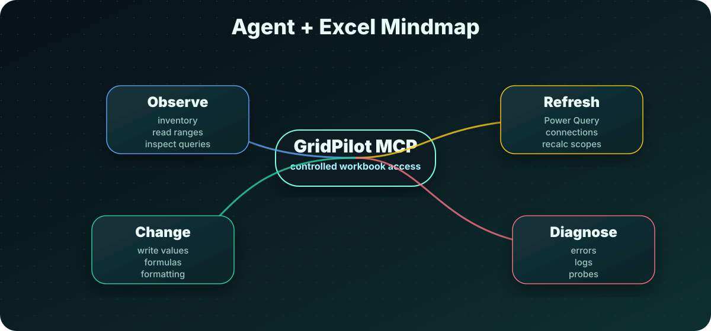
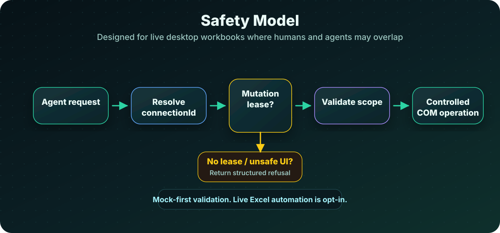

# GridPilot MCP

<p align="center">
  
</p>

**Let coding agents work with live Excel — safely, visibly, and under control.**

GridPilot MCP is a local automation bridge for Microsoft Excel. It gives coding agents a controlled way to inspect, edit, refresh, and diagnose real desktop workbooks.

Excel remains the **data plane**. GridPilot becomes the **control plane**.

Agents work through scoped MCP tools for sessions, ranges, formulas, worksheets, tables, Power Query definitions, names, formatting, refreshes, and diagnostics. The bridge owns the risky and boring parts: routing, COM interaction, mutation permissions, cleanup, retries, logging, and structured failure reporting.

This is not about unattended spreadsheet chaos. It is about safe human + agent collaboration on the Excel files people actually use.

---

## Why GridPilot Exists

Excel is still a runtime for real business work: reporting, reconciliation, operational data, financial models, Power Query pipelines, formulas, named ranges, and workbook conventions that are often undocumented but critical.

Coding agents can already edit source files. The harder problem is giving them safe, observable access to the workbook itself: the live document, the active queries, the actual formulas, the formatting, the current errors, and the state Excel sees right now.

GridPilot MCP gives agents a practical workbook control surface without pretending Excel is just another text file.

---

## The GridPilot Approach

GridPilot is built around a few rules that keep the system useful without turning it into a free-for-all automation tunnel:

- **Excel stays the data plane.** The workbook remains the source of truth.
- **GridPilot is the control plane.** Agents operate through explicit, routed tool calls.
- **The C# bridge owns the desktop edge.** Session routing, COM interaction, leases, cleanup, retries, and diagnostics live outside the workbook.
- **Tools are scoped.** Agents get workbook operations, not a vague “run anything in Excel” escape hatch.
- **Validation is mock-first.** Live Excel automation is opt-in for tests and investigations.
- **Humans remain part of the model.** Attached-session safety matters because people may be editing the same workbook.

<p align="center">
  
</p>

---

## What Agents Can Do Today

GridPilot exposes the workbook surface as practical capabilities rather than raw desktop automation.

### Sessions and routing

Discover running Excel instances, list open workbooks, attach by workbook name or path, create a new workbook, and route later calls through a stable `connectionId`.

### Workbook structure

Inventory sheets, queries, connections, tables, and names. Create, rename, delete, move, copy, reorder, and hide worksheets, including `veryHidden` visibility.

### Ranges, formulas, and layout

Read and write rectangular values, formulas, compact formatting snapshots, row heights, column widths, autofit behavior, and layout-preserving clears. GridPilot also distinguishes true no-fill state from explicit fill state so agents can preserve workbook styling accurately.

### Power Query

Read query definitions, update query formulas, run targeted refreshes, execute diagnostic probes, and clean up temporary diagnostic queries. This gives agents a path for schema checks, dependency investigation, and controlled refresh workflows.

### Tables and names

Create, resize, append, replace, delete, and configure Excel tables. List, resolve, read, create, update, or delete workbook- and worksheet-scoped names.

### Diagnostics and safety

Run workbook-, worksheet-, and range-scoped recalculation. Inspect compact formula and literal errors. Use mutation-permission leases for attached sessions. Capture runtime logs across the host, bridge, and COM adapter.

<p align="center">
  
</p>

<p align="center">
  
</p>

---

## How It Works

GridPilot runs locally beside desktop Excel.

A typical MCP client starts or connects to the GridPilot host. The host attaches to an existing workbook session or creates a new workbook, then returns a `connectionId`. Later tool calls use that `connectionId` so operations stay routed to the intended workbook.

The C# bridge translates scoped workbook requests into controlled Excel COM operations. Runtime logs and structured errors make failures inspectable when Excel behaves unexpectedly.

<p align="center">
  
</p>

---

## Get GridPilot

If you want to use GridPilot on another Windows machine:

1. Open the public GitHub repository and download the latest `gridpilot-mcp-vX.Y.Z-windows-x64.zip` release.
2. Unpack the archive and read `README.md` plus `docs/topics/mcp-setup-and-troubleshooting.md`.
3. Launch `GridPilot.Tray.exe` for the dashboard, or register `host/ExcelMcp.ToolHost.exe` with your MCP client.

For the release workflow and packaging details, see `docs/topics/public-distribution-and-release-workflow.md`.

If you prefer source instead of a release archive:

```powershell
git clone <github-mirror-url>
cd gridpilot-mcp
dotnet build ExcelMcp.sln -c Release
```

The local build path keeps the usual `bin/Release` outputs, while the release ZIP is produced separately from tagged pipelines.

---

## Mental Model

GridPilot is useful when an agent needs to observe, change, refresh, or diagnose workbook state while keeping the interaction explicit and reviewable.

<p align="center">
  
</p>

---

## Safety Model

GridPilot is designed for controlled workbook automation, especially when a human may also have the workbook open.

The current safety model includes:

- explicit workbook connections through `connectionId`
- mutation-permission leases for attached sessions
- scoped recalculation instead of blanket workbook churn
- structured failures instead of silent UI-driven behavior
- runtime logging across host, bridge, and COM adapter
- cleanup of temporary diagnostic artifacts
- mock-first validation for normal development
- opt-in live Excel testing

<p align="center">
  
</p>

---

## Typical Flow

1. Register or start the MCP host.
2. Attach to an open workbook or create a new one.
3. Connect and receive a `connectionId`.
4. Inspect, edit, refresh, and diagnose through scoped tools.
5. Enable runtime logging when troubleshooting real Excel behavior.

For setup commands, client registration details, and troubleshooting notes, use:

- [MCP setup and troubleshooting](docs/topics/mcp-setup-and-troubleshooting.md)

---

## For Contributors

Useful project references:

- [AGENTS.md](AGENTS.md) — fast operational rules for agents working in this repo.
- [Current state](docs/handoff/current-state.md) — current implementation baseline.
- [Next steps](docs/handoff/next-steps.md) — active follow-on priorities.
- [Technical topics](docs/topics/README.md) — focused notes and setup references.
- [Workbook surface roadmap](docs/topics/workbook-surface-roadmap.md) — capability expansion order and planned follow-on slices.
- [Branding](branding/README.md) — brand usage and presentation-kit guidance.

Contributor note: some internal project and namespace names may still use provisional `ExcelMcp.*` identifiers while the public-facing GridPilot identity continues to settle.

---

## Current Priorities

Near-term work is focused on:

- keeping the portable ZIP release flow and GitHub mirror in sync
- adding conservative optional config writers only after preview/copy behavior is stable
- keeping runtime logs file-backed and MCP stdout JSON-RPC only
- keeping installer/startup registration separate from the portable release ZIP path
